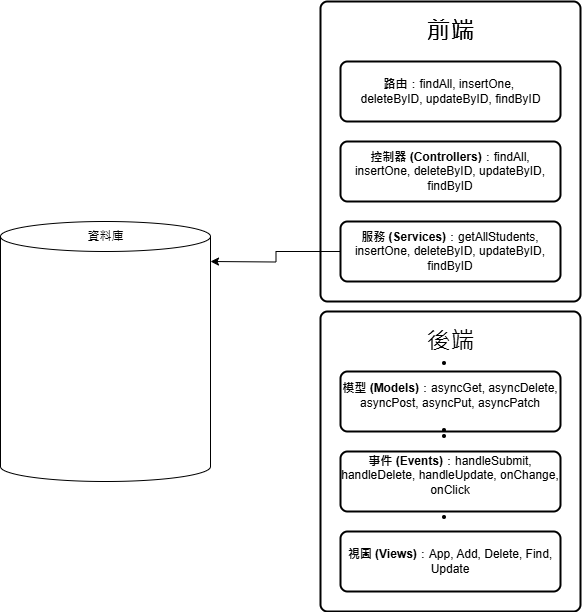

# 專案名稱: StudentHub

## 專案簡介
`StudentHub` 是一個展示如何使用 MongoDB Compass、Docker、TypeScript 和 React 管理數據庫和構建前端應用的範例專案。專案包含一個名為 `students` 的集合，保存學生的基本信息，包括學號、姓名、系所、年級、班級和電子郵件。專案展示了如何實現與數據庫交互的 TypeScript 服務層和控制器，以及前端應用和樣式的定義。

## 安裝與執行
### 環境需求
- **操作系統**：Windows, macOS, Linux
- **軟體要求**：MongoDB, MongoDB Compass, Docker, Node.js, npm

### 安裝步驟
1. 安裝 MongoDB：
   ```bash
   # Windows
   choco install mongodb

   # macOS
   brew tap mongodb/brew
   brew install mongodb-community@5.0

   # Linux
   sudo apt-get install -y mongodb
### API規格說明
請求 URL：http://localhost:0206/api/v1/user/findAll

### 查詢所有學生資訊
方法：GET

端點：/findAll

請求：

```BASH
{
"userName": "tkuxx0000",
"name": "姓名",
"department": "科系",
"grade": "年級",
"class": "班級",
"email": "example@gmail.com"
}
```
回應：

```BASH
{
{
    "code": 200,
    "message": "insert success",
    "body": {
        "userName": "tkuxx0000",
        "sid": "座號",
        "name": "姓名",
        "department": "科系",
        "grade": "年級",
        "class": "班級",
        "email": "example@gmail.com",
        "_id": "ID",
        "__v": 缺席次數
    }
}
```


### 架構圖 
 
### 流程圖 

### Demo影片： 
https://youtu.be/6XIILDaRSpI